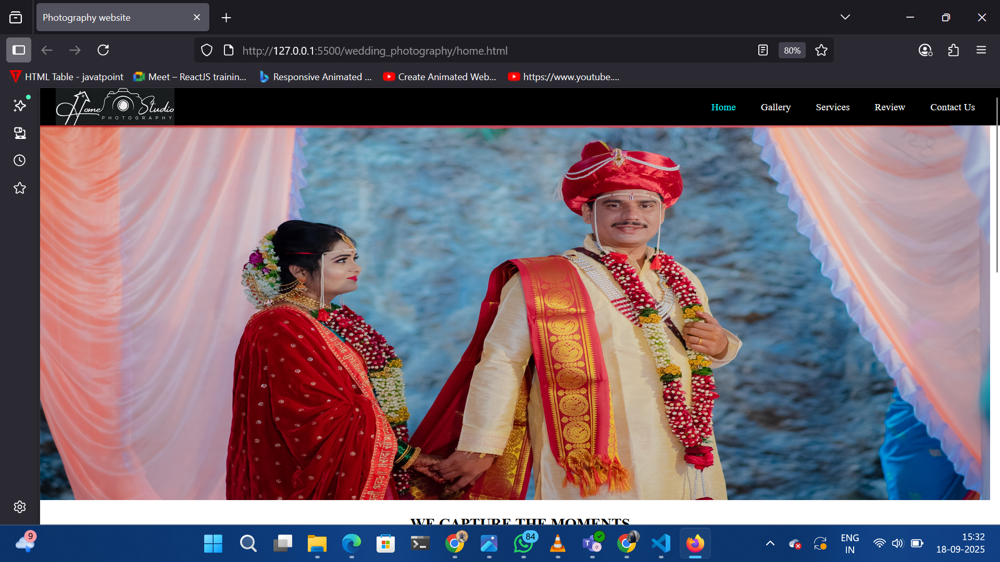
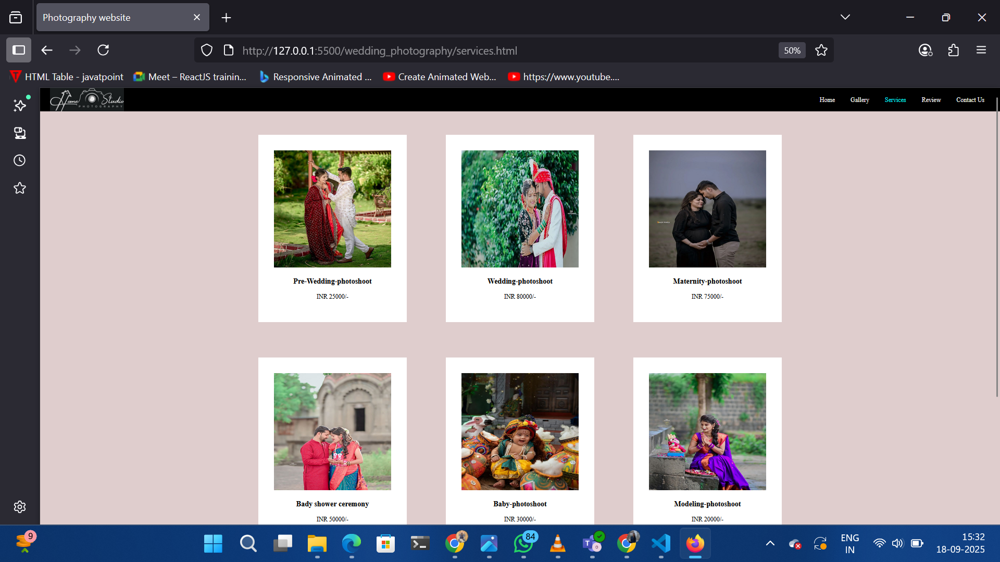
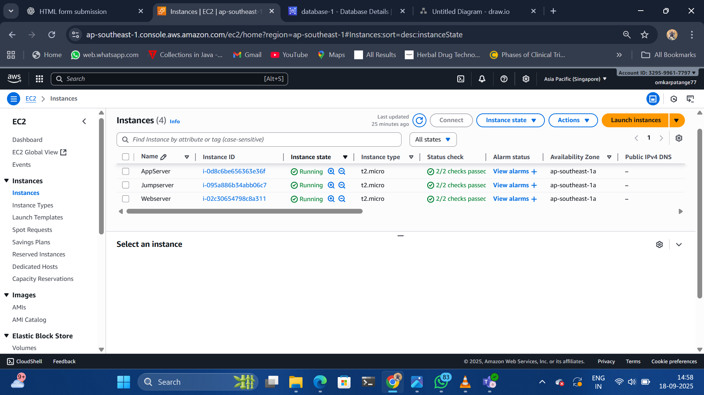
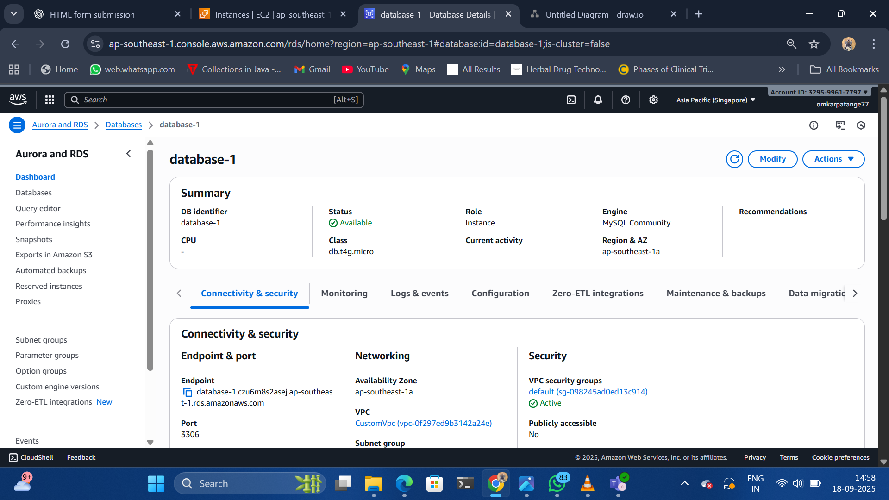
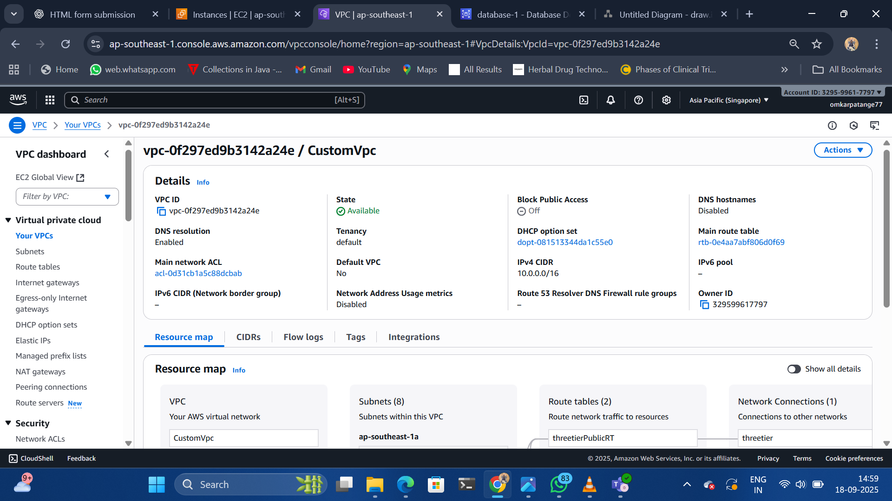
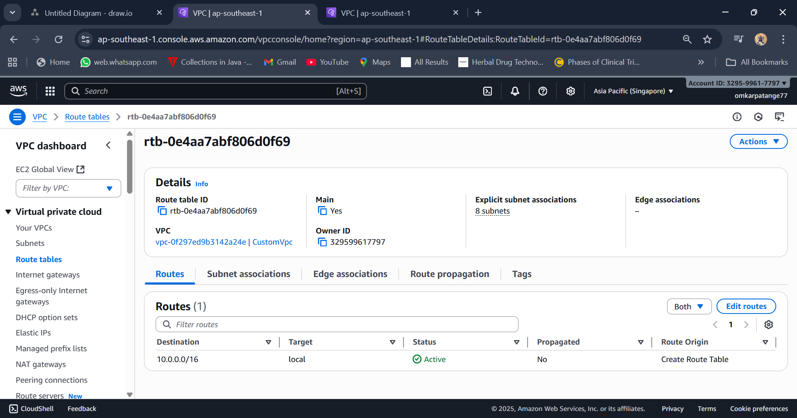
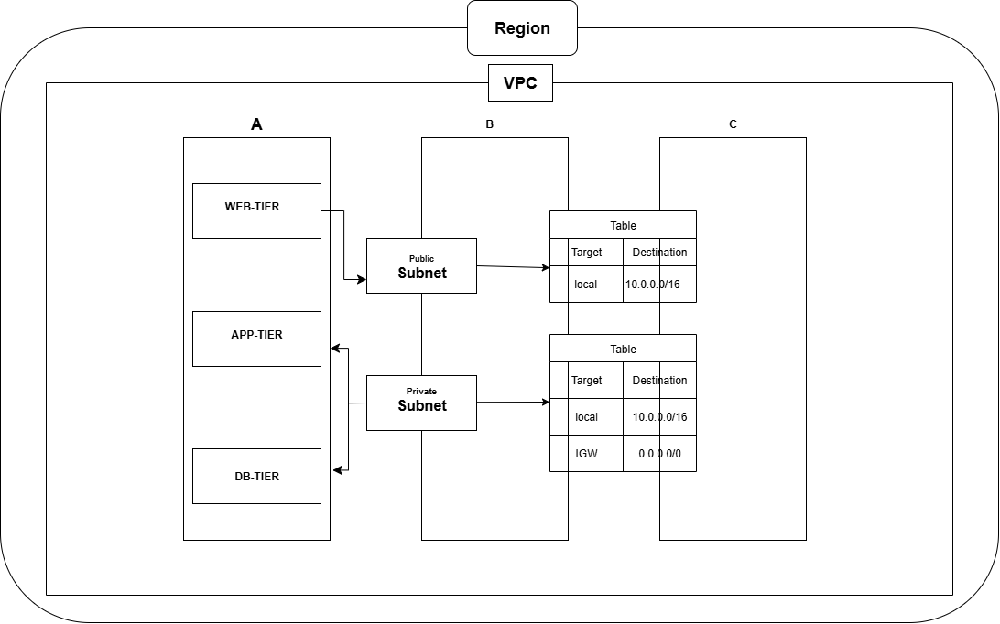
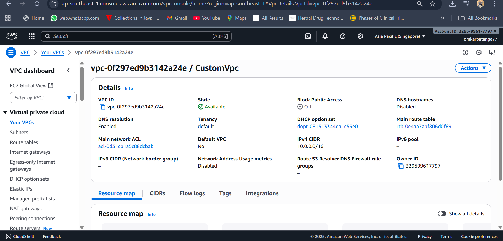
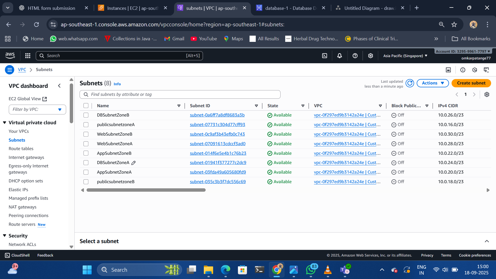
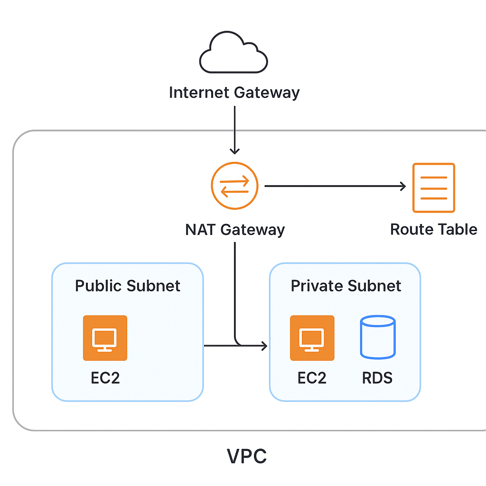

# 📸 Wedding Photography Website

A **Wedding Photography** web application with **frontend UI**, **backend integration**, and **database connectivity**, deployed on a **Three-Tier AWS Architecture**.

---

## 🚀 Features
- **Home Page** – Elegant landing page with photography showcase
- **Gallery** – Displays wedding photography collections
- **Services** – Detailed list of photography packages
- **Contact Form** – Submit inquiries via PHP backend
- **User Registration & Login** – Secure authentication with PHP & MySQL
- **Payment Page** – Payment processing interface
- **Reviews** – User feedback and testimonials
- **Responsive Design** – Styled with CSS for modern UI/UX

---

## 📂 Project Structure

Wedding-Photography/ 
├── frontend/ 
│   ├── html/ 
│   │   ├── home.html 
│   │   ├── gallery.html 
│   │   ├── services.html 
│   │   ├── services1.html 
│   │   ├── services2.html 
│   │   ├── services3.html 
│   │   ├── services4.html 
│   │   ├── services5.html 
│   │   ├── services6.html 
│   │   ├── contact.html 
│   │   ├── login.html 
│   │   ├── registration.html 
│   │   ├── payment.html 
│   │   ├── successPage.html 
│   │   └── review.html 
│   └── css/ 
│       │   ├── home.css 
│       │   ├── gallery.css 
│       │   ├── services.css 
│       │   ├── contact.css 
│       │   ├── login.css 
│       │   ├── review.css 
│       │   └── style.css 
│       └── images/ 
│           ├── mc.png 
│           └── pp.pngv
├── backend/ 
│   ├── php/ 
│   │   ├── contact.php 
│   │   ├── login.php 
│   │   ├── payment.php 
│   │   └── database.php 
└── README.md

---

## 🏗️ Architecture (AWS Three-Tier)
This project is deployed on **AWS Three-Tier Architecture**:

1. **Presentation Tier (Frontend)**  
   - HTML, CSS, JavaScript  
   - Hosted on AWS EC2 (public subnet) or S3 + CloudFront  
 
2. **Application Tier (Backend)**  
   - PHP files (`login.php`, `contact.php`, `payment.php`)  
   - Runs on Apache/Nginx inside a private subnet EC2 instance  
 
3. **Database Tier**  
   - MySQL hosted on **AWS RDS** (private subnet)  
   - Connected via `database.php`  
 

4. **Networking Setup**  
   - **VPC**
   
    with public & private subnets  
   - **Route Tables** for traffic flow  
   
   - **Internet Gateway (IGW)** for frontend access  
   
   - **NAT Gateway** for backend → internet traffic  
   - **Security Groups & NACLs** for security  
 

---

 AWS 3‑Tier Architecture Overview

The three tiers are:

Tier	Purpose	AWS Components / Characteristics
Web / Presentation Tier	Handles incoming client requests, serves static content, TLS termination, load balancing	Public subnets, Internet Gateway, Load Balancers (ALB / ELB), Web servers (EC2 / Auto Scaling)

Application / Logic Tier	Business logic, processing, internal APIs	Private subnets, limited inbound access (only from Web tier), NAT or outbound Internet via NAT Gateway if needed
Database / Data Tier	Data storage, persistent databases or caches	Private subnets, highly restricted access (only from App tier), possibly multi‑AZ RDS, etc.

📸 Screens (Pages)

home.html → Homepage
## 🏗️ Architecture Diagram  

gallery.html → Wedding gallery

## Detail Flow
services.html → Services offered
## Design

## Design

## Design

## Design

## Design

contact.html → Contact form
login.html / registration.html → User auth
payment.html / payment.php → Payment integration
review.html → Client reviews

The diagram will include In ThreeTier Architecture:
## 🏗️ Architecture Diagram  

## VPC

Public Subnet → EC2 (Frontend / Web Tier)
Private Subnet → EC2 (Backend / App Tier)

## Routing & Security
Public subnets have route to 0.0.0.0/0 via Internet Gateway.

App subnets have route to 0.0.0.0/0 via NAT Gateway(s) placed in public subnets.

DB subnets could have no direct route to Internet, or route only via NAT (or none, depending on isolation).

Use Security Groups / Network ACLs so that only App tier can talk to DB tier (on DB ports), Public tier can talk to App tier (HTTP, etc.), etc.

| Tier                        | AZ   | CIDR         | Purpose / Notes                                |
| --------------------------- | ---- | ------------ | ---------------------------------------------- |
| **Public**                  | AZ-1 | 10.0.0.0/24  | For load balancers, NAT gateway, bastion hosts |
| **Public**                  | AZ-2 | 10.0.1.0/24  | Same as above in second AZ                     |
| **App (private)**           | AZ-1 | 10.0.10.0/24 | Application servers, internal logic            |
| **App (private)**           | AZ-2 | 10.0.11.0/24 | App tier in AZ2                                |
| **DB (private / isolated)** | AZ-1 | 10.0.20.0/24 | Database servers (e.g. MySQL, PostgreSQL)      |
| **DB (private / isolated)** | AZ-2 | 10.0.21.0/24 | DB tier in AZ2                                 |

Private Subnet → RDS (Database Tier)

## Internet Gateway

An Internet Gateway is a VPC component that enables communication between resources inside a Virtual Private Cloud (VPC) and the Internet. 
Internet Gateway + NAT Gateway

It is horizontally scaled, redundant, and highly available — AWS abstracts away internal scaling/fault handling so you don’t worry about performance or single points of failure. 

Route Tables showing connectivity
Public subnets have route to 0.0.0.0/0 via Internet Gateway.

App subnets have route to 0.0.0.0/0 via NAT Gateway(s) placed in public subnets.

DB subnets could have no direct route to Internet, or route only via NAT (or none, depending on isolation).

